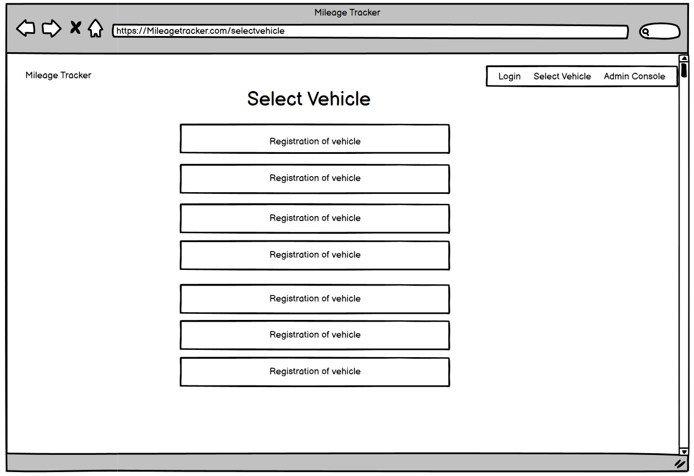
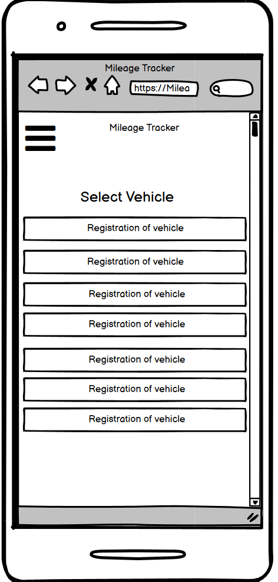
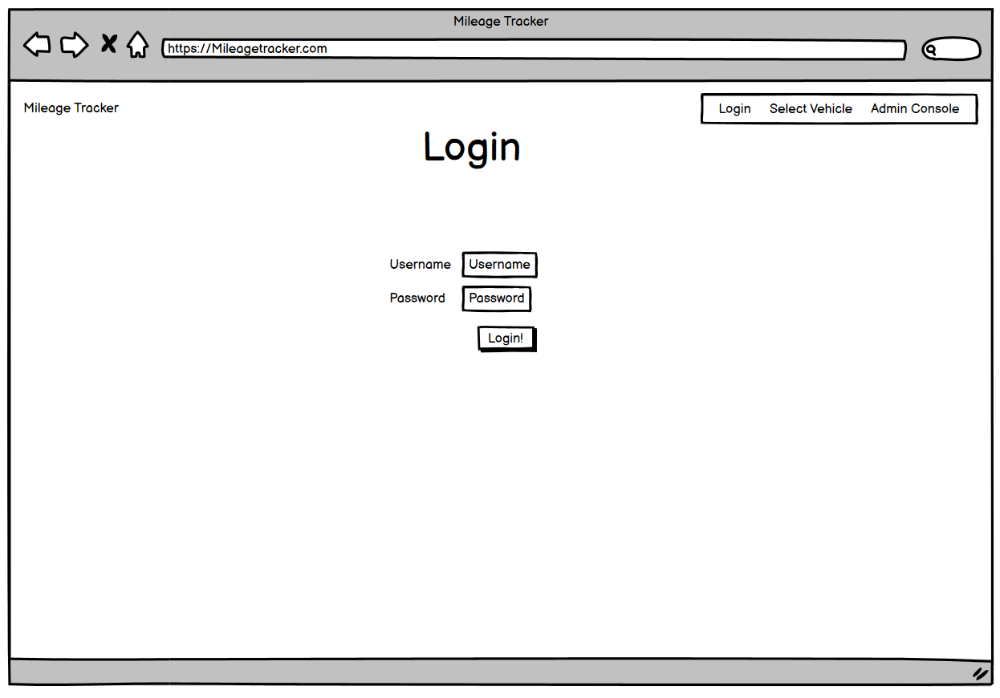
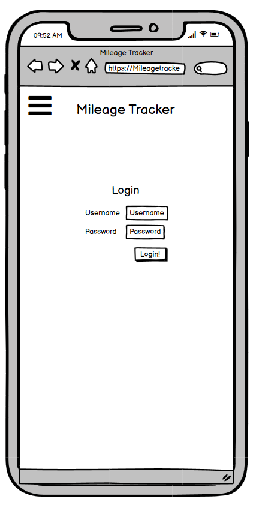
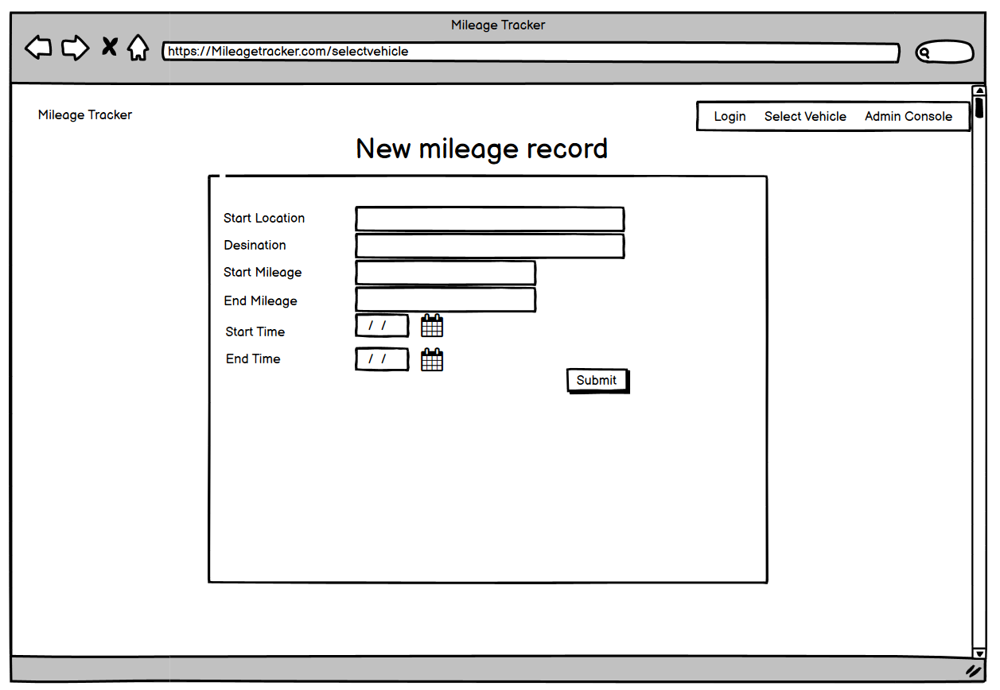
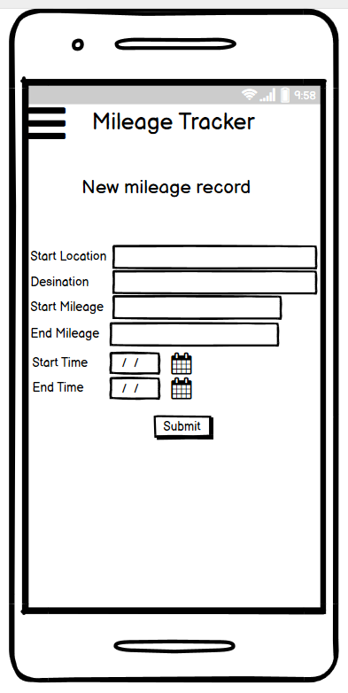

# Table of Contents

1. [Overview](#Overview)
2. [User Experience](#User Experience)

    - [User Stories](#User Stories)
    - First Time Visitor Goals
    - Returning Visitor Goals
    - Developer Goals

3. [Wireframes](#Wireframes)

4. [Design](#Design)

5. [Features](#Features)

6. [Languages Used](#Languages)

7. [Technologies](#Technologies)

8. [Testing](#Testing)

9. [Deployment](#Deployment)

10. [Credits](#Credits)

# Overview

**Mileage Tracker** is a web application that wil be used to track the mileage of a work provided vehicle. There is a need for this in my current workplace, as currently paper based systems are still in use, which is tedious and time consuming. 
# User Experience

# User Stories

- As a user, I want to be able to record the trips I am taking in a given Vehicle
- As a user, I want to be able to edit any of the previous trips I have taken incase of a typo
- As a user, I want the structure of the site to be intuitive and easy to navigate
- As a user, I want to be able to delete a Vehicle when it is no longer in the companies possession
- As a user, I want to be able to access the site on all devices, though this is primarily a mobile app
- As a user, I want access to be restricted for certain actions to Administrators, such as creating new accounts, deleting vehicles and deleting more than the previous mileage record
### First Time Visitor Goals

- A simple and responsive navigation throughout the site
- To be able to register to a mileage record
- To be able to login to the app
- To be able to log out of the app
### Returning Visitor Goals

- To be able to view past trips

### Developer Goals

- To create a database with POSTGRESQL  
- To implement CRUD functionality using flask-sqlalchemy
- To create a responsive, clean and consistent UX
- To not allow users to edit/delete other users mileage records#
- To ensure there is a level of permissions so standard user's cant delete Vehicles and multiple mileage records

### User Story

```
As a user, I want to be able to record the trips I am taking in a given Vehicle
```

Criteria

- Site must have a database that is fully functional

Implementation

- Install postgres database

### User Story
```
As a user, I want the structure of the site to be intuitive and easy to navigate
```

Criteria

- Add a navigation menu
- Have a Register and Login page. The register page will be restricted to Admin accounts. 
- Display the vehicles to select from in a structured layout on the home page

Implementation

- The UI/UX for the site has to be consistent, intuitive and responsive across all devices to achieve this
### User Story
```
As a user, I want to be able to delete a Vehicle when it is no longer in the companies possession
```

Criteria

- create a delete button 
- ensure the user wants to delete it
Implementation

- Implement Delete functionality on the Vehicles table. Only an admin should have access to do this 
### User Story
```
As a user, I want to be able to access the site on all devices, though this is primarily a mobile app
```

Criteria

- have responsive site that renders well on all device sizes

Implementation

- Use materlize to ensure it scales well
- Develop with a mobile first approach, so it will always work on larger and small devices
### User Story
```
As a user, I want access to be restricted for certain actions to Administrators, such as creating new accounts, deleting vehicles and deleting more than the previous mileage record
```
Criteria

- implement roles
- implement a separate page for all the admin functions
- restrict addition of roles to admin accounts
- ensure that standard users cant access any of the restricted pages

Implementation

- Alongside flask-login, I will create a decorator to ensure that the user trying to access the route has the admin role.

## Navigation
On initial loading, the login in screen will present itself

The navigation menu will have links to the home page and the admin console. It will also have a log out link that when clicked, logs the user out and returns them to the login page


## Wireframes
<details closed>
<summary>Desktop Home</summary>


</details>

<details closed>
<summary>Desktop Mobile</summary>


</details>

<details closed>
<summary>Desktop Login</summary>


</details>

<details closed>
<summary>Mobile Login</summary>


</details>

<details closed>
<summary>Desktop New Mileage</summary>


</details>

<details closed>
<summary>Mobile New mileage</summary>


</details>

# Design

### Colour Scheme

I've chosen two main colours, to keep the theme simple and consistent. Blue and white.

### Fonts

I will use the standard font for this app, as it is a utilitarian app, not made to look amazing and slow down browsers
### Imagery

In keeping with the minimalistic theme, there is no imagery throughout the app
### Back-end design

- The app is created using Python3 and a Flask framework to render the HTML pages.
- The app uses flask-login to implement the account functionality.

- The site is deployed via a Heroku app linked to a GitHub repository.
- The mileage records, user profiles and different vehicles are stored and served using a postgres database.
### Front-end design

- The front end is kept simple and light. Using a card method to display differnt mileage records, which can be expanded to further view the details when clicked on
- The vehicle selection page is also simple, it just lists each registered vehicle as a button, clicking it will take you to the page where you can view the mileage records or enter a new one
- The admin console conists of square cards that are also links to take you to the page to render the desired functionality
# Features

### Main Features

-	Responsiveness – The site is fully responsive to all screen sizes. This was acheived by using the materalize CSS framework and using this with a mobile first approach. As this is app will primarily be a mobile app, it was import to ensure this functionality worked. 

-	Navbar  – The navbar was also implemented using materilize CSS. This is because it makes the creation of a mobile navigation menu painless and easy. The nav bar doesn't consist of many links, as the main navigation takes place via form and button functionality on the pages.

-	Flash messages – I have used flash messages to inform users about events such as creating accounts, logging out, unauthorized access to restricted pages etc. 
### Home Page
-	On the home page, a list of the available vehicles is presented in a card form. Each one is a clickable button that takes you to another page to view more details on the vehicle. 
### View Vehicle Details

-	On this page, the last 10 mileage records are shown in a card format, allowing the user to view, edit or delete them. Each card is expandable to show all the data for that record. 
-   Underneath all the records, there is a button to add a new entry that takes you to a form page, where you enter the relevant details and then press enter. 
-	Forms – The forms on these pages are clear and concise, and responsive across all screen sizes. 
# Languages

- [HTML5](https://developer.mozilla.org/en-US/docs/Web/HTML)
Used to structure the and display webpages

- [Python3](https://www.python.org/)
Used to create the main application functionality by serving data from the database and rendering HTML templates

- [CSS3](https://developer.mozilla.org/en-US/docs/Web/CSS)
Used to style individual webpages

- [Javscript](https://www.javascript.com/)
Used to add some front end interactivity and for the automatic time insertion on the mileage record form

# Technologies

**Libraries**
- [Flask](https://www.fullstackpython.com/flask.html)
Python web framework

- [Werkzeug](https://werkzeug.palletsprojects.com/en/1.0.x/)
A comprehensive WSGI web application library installed with Flask

- [Flask-Sqlalchemy](https://flask-sqlalchemy.palletsprojects.com/en/2.x/)
Flask-SQLalchemy provides the framework for working with flask and databases in python
**Frameworks**
-[Materlize](https://materializecss.com/)
Used to make a responsive and lightweight front end
**Database**
- [PostgreSQL](https://www.postgresql.org)
Relational database used to store all the persistent data

**Tools**
- [Visual Studio Code](https://code.visualstudio.com/)
I used visual studio code as the IDE for this website. It has many extensions that make developing easier.

**Deployment**
- [Heroku](https://www.heroku.com/)
Heroku is a platform as a service (PaaS) application that provides developers with hosting and data storage in the cloud. There are many tiers of service, though I used the free one. 

# Testing

CERATE TESTING DOC and link here

# Deployment
#### Creation of a Python Virtual Environment ####
Creating a virtual python environment allows you to only install the packages required for your project and helps to stop system wide packages causing errors within your project. 
When using VS Code, if there is a venv folder in your project, it will automatically start the virtual environment when you open the terminal. 

*Note: The process may be different depending upon your own OS - please follow this [Python help guide](https://python.readthedocs.io/en/latest/library/venv.html)
to understand how to create a virtual environment*

#### Install the required packages ####

- After initialising the venv, in your IDE terminal, install the dependencies from the requirements.txt file with the following command:
 
pip install -r requirements.txt

#### Create the database in PostgreSQL #####
- Download the postgres client from their website [postgreSQL](https://www.postgresql.org/download/) and follow the set up guidance in the wizard. 
- If you are using windows, in order to use the PSQL terminal in your IDE, you will need to set up environment variables to point to the terminal application. A Guide to do this can be found here [Terminal](https://blog.sqlbackupandftp.com/setting-windows-path-for-postgres-tools)

 #### Create env.py file ####

- The env.py file should contain the below details:
- when deploying to heroku, these also need to be configured in the config vars section

```
import os

os.environ.setdefault("IP", "0.0.0.0")
os.environ.setdefault("PORT", "5000")
os.environ.setdefault("SECRET_KEY", "your_secret_key")
os.environ.setdefault("DB_URL", "postgresql:///databasename")

```

- Please ensure you add in your own SECRET_KEY and DB_URL values.
- Ensure that the env file is in your 

#### Run the application ####

- To run the application enter the following command into the terminal window:

```
python3 app.py
```

### Deploying the app to Heroku ###

#### Create the Heroku App ####

- Ensure you have an account created at [Heroku](https://signup.heroku.com/login)
- Log in to your Heroku account dashboard and create a new app.
#### Push your repository to GitHub ####

- Commit and push your local repository to your GitHub linked repository

- create the Procile and requirements file using the following commands:


echo web: python app.py > Procfile
pip3 freeze --local > requirements.txt


- Push your local Git repository to GitHub

#### Connect Heroku to GitHub ####

- In the Heroku App Settings page, open the section Config Vars
- Add all the variables from the env file as individual vars


- In the Heroku App Deploy page: 
  - Select GitHub from the Deployment Method options
  - Select Connect to GitHub
  - Log in to your GitHub account from Heroku to link the App to GitHub
  - Search for and select the repository to be linked in Github
  - Select Connect
  - Select Enable Automatic Deployment from GitHub

- Then create the database in the python shell via heroku: 
    - Select more, then Run console
    - Type in 'Python'
    - Once the python shell opens, type 'from mileagetracker import db'
    - then type db.create_all()

#### Launch the App ####

- Click Open App in Heroku to launch the App in a new browser window.

**Successful deployment**

# Credits

- **Code Institute**
  - Task Manager Tutorial
- Flask documentation for flask-login implementation [docs](https://flask.palletsprojects.com/en/2.1.x/)
